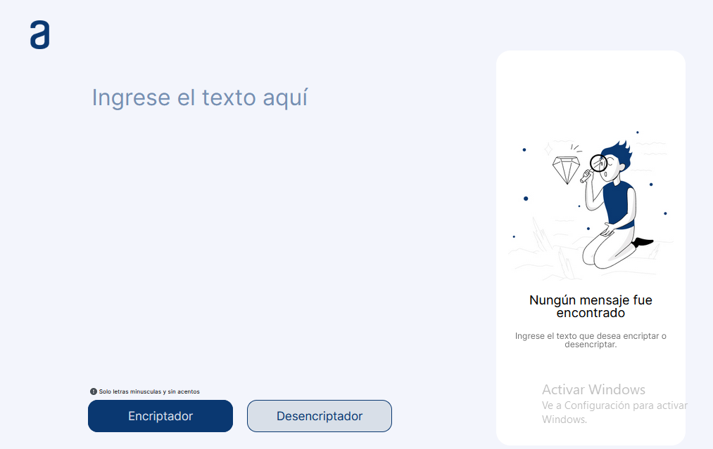

# Encriptador
Cifra y descifra palabras ingresadas por el usuario.

**Imagenes de la structura creada con HTML y CSS**

En la imagen se puede apreciar que tenemos dos secciones, una con un textarea que espera recibir el texto del usuario. También hay dos botones, encriptar y desencriptar, con sus respectivas funcionalidades. Después tenemos otra sección, también con un textarea que nuestra el resultado de la encriptación, una imagen, un párrafo y un botón de copiar, que al principio está oculto. El botón se encarga de copiar el código encriptado.
